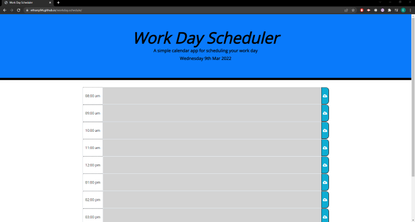
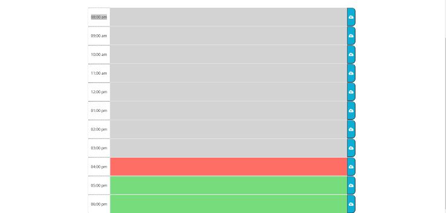

# workday.schedule

This is a simple workday calender application that allows the user to save envent for each hour of the workday. The past, present, and futre events are all color coded for ease of identification. It run in the browers and feature a dynamically updated HTML and CSS powered by jQuery.

https://ethanp94.github.io/workday.schedule/

https://github.com/EthanP94/workday.schedule

